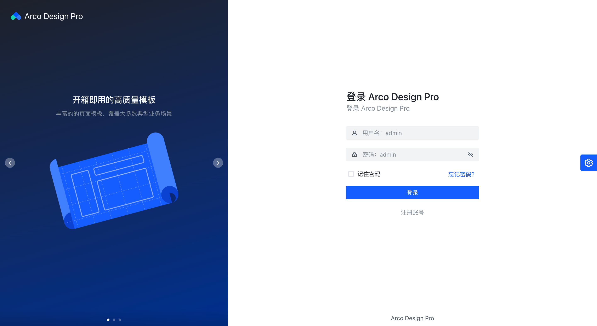

# 第35节：后台项目搭建


# 原计划使用的技术栈

> React 16.8.6 + [antd V4](https://ant.design/docs/react/introduce-cn) + [umi V3](https://umijs.org/zh-CN/docs)+ [Ant Design Pro V4](https://pro.ant.design/docs/getting-started-cn) 

## 1.创建项目

A.打开[Ant Design Pro V4](https://pro.ant.design/docs/getting-started-cn)

```bash
$ cd class
```

B.执行

```bash
$ yarn create umi admin # admin项目名
#OR
$ npm create umi admin

```

在class目录下创建admin文件夹即为后台管理系统的项目目录。

C.选择配置：

1.Select the boilerplate type

选 `ant-design-pro`

2.Be the first to experience the new umi@3 ?

选 `Pro V4`

3.Which language do you want to use?

选 `JavaScript`

4.Do you need all the blocks or a simple scaffold? (Use arrow keys)

选`simple`

5.Time to use better, faster and latest antd@4! (Use arrow keys)

选`ant@4`

耐心等待下载。


## 2.目录结构介绍

├── config                   # umi 配置，包含路由，构建等配置
├── mock                     # 本地模拟数据
├── public
│   └── favicon.png          # Favicon
├── src
│   ├── assets               # 本地静态资源
│   ├── components           # 业务通用组件
│   ├── e2e                  # 集成测试用例
│   ├── layouts              # 通用布局
│   ├── models               # 全局 dva model
│   ├── pages                # 业务页面入口和常用模板
│   ├── services             # 后台接口服务
│   ├── utils                # 工具库
│   ├── locales              # 国际化资源
│   ├── global.less          # 全局样式
│   └── global.js            # 全局 JS
├── tests                    # 测试工具
├── README.md
└── package.json

## 3.启动项目

```js
cd admin
yarn 
yarn start
```

> 启动命令可参看：package.json


# 现计划使用的技术栈

技术栈为 `React` + `ES2015+` + `TypeScript` + `bizcharts` 和 `Arco Design pro`，提前学习和了解这些知识将帮助你更好地上手我们的项目。

> 由于近期抖音团队发布了[arco design](https://arco.design/) 和 [semi design](https://semi.design/zh-CN/)
>
> 我就决定来体验下。
>
> 同时为大家推荐一个字节跳动发布`现代 Web 工程体系`的[modern.js](https://modernjs.dev/docs/start/mobile)


## 为什么叫 arco design?


## 我们使用什么？


## [快速开始](https://arco.design/docs/pro/start)

### 环境准备

开始开发之前，请确认本地环境中安装好了 `node`， `git` 和 `arco cli`。

其中 `arco cli` 是安装项目模版的工具，请运行以下命令安装：

```
npm i -g @arco-design/arco-cli
```

如果这个安装不了那么有可能是你的npm源找不到包。我们可以设置下npm源来安装

```
npm --registry https://registry.npm.taobao.org install @arco-design/arco-cli -g
```

### 安装

```
cd class 
arco init admin # admin即为项目名
```

这里我当时安装遇到一个错误，就是我的class目录在git中有未提交的代码，人家这个arco-cli也检测到了。就让你把git的代码提交了。在执行`arco init admin`来安装。


去提交了，然后来创建即可。


正在安装项目依赖，这可能需要几分钟时间，请耐心等待...

### 开发

```
cd admin

npm run dev
```

打开 localhost:9090 就能看到如下页面：




